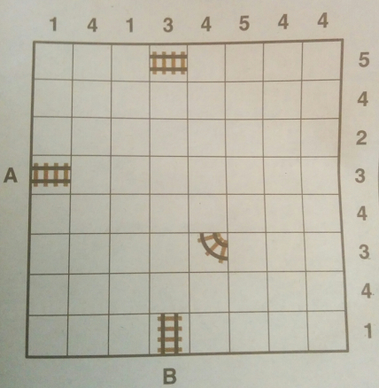

# `traintracks`

A solver for the Train Tracks puzzle written in JavaScript

## The Puzzle

In the Saturday Times (in the UK), there is a puzzle called Train Tracks.

It's an 8x8 grid of squares. Each row and column has a number which 
tells you how many pieces go in that row or column.

There is also a marker for `A` and `B` the start and end of the track.
There are possibly one or more other pieces already on the grid.

Your job is to draw the track using only staight or 90 degree corner 
piece from `A` to `B` so that the correct number of pieces is present
in each row and column of the grid.

Here's an example puzzle:



## Encoding Puzzles

We encode the puzzle as follows: `<A><B>-<cols>-<rows>-<pieces>`.

The puzzle above is `54-14134544-54234341-48EW.53NE`

`A` and `B` are the number 1-8 indicating how far along the grid (from
the bottom-left) the start (how far up) and finish (how far right). In this
example `A` is `5` and `B` is `4`

`cols` is a list of 8 numbers 1-8 indicating the constraint on the column. 
numbers read left-to-right (along the top of the puzzle as pictured).

`rows` is the same for the rows, this time top to bottom, making it easier
to follow from the real puzzle.

`pieces` are the list of initial pieces (not counting the start and finish) separated
by a dot `.` and are `<rol><col><type>`where type is the way the piece points. The valid
types are `NS` (vertical) `EW` (horizontal) `NE` L-shaped, `NW` backwards-L, `SE` upside-L, `SW` 180degree rotated L.

This is a lot easier to type in than it sounds. But if this was used on a website, then a more intuitive UI could create the puzzle and generate the encoding.

## The Solver

Anyway once we have the encoding we can call the `traintracks` tool:

```
$ traintracks 54-14134544-54234341-48EW.53NE
Puzzle: 54-14343245-14134544-48EW.53NE
    1 4 1 3 4 5 4 4            1 4 1 3 4 5 4 4
   ┌─┬─┬─┬─┬─┬─┬─┬─┐          ┌─┬─┬─┬─┬─┬─┬─┬─┐
 8 │ │ │ │━│ │ │ │ │ 5      8 │ │┏│━│━│━│┓│ │ │ 5
   ├─┼─┼─┼─┼─┼─┼─┼─┤          ├─┼─┼─┼─┼─┼─┼─┼─┤
 7 │ │ │ │ │ │ │ │ │ 4      7 │ │┃│ │ │ │┗│━│┓│ 4
   ├─┼─┼─┼─┼─┼─┼─┼─┤          ├─┼─┼─┼─┼─┼─┼─┼─┤
 6 │ │ │ │ │ │ │ │ │ 2      6 │ │┃│ │ │ │ │ │┃│ 2
   ├─┼─┼─┼─┼─┼─┼─┼─┤          ├─┼─┼─┼─┼─┼─┼─┼─┤
 A │━│ │ │ │ │ │ │ │ 3      A │━│┛│ │ │ │ │ │┃│ 3
   ├─┼─┼─┼─┼─┼─┼─┼─┤          ├─┼─┼─┼─┼─┼─┼─┼─┤
 4 │ │ │ │ │ │ │ │ │ 4      4 │ │ │ │ │┏│━│━│┛│ 4
   ├─┼─┼─┼─┼─┼─┼─┼─┤          ├─┼─┼─┼─┼─┼─┼─┼─┤
 3 │ │ │ │ │┗│ │ │ │ 3      3 │ │ │ │ │┗│━│┓│ │ 3
   ├─┼─┼─┼─┼─┼─┼─┼─┤          ├─┼─┼─┼─┼─┼─┼─┼─┤
 2 │ │ │ │ │ │ │ │ │ 4      2 │ │ │ │┏│━│━│┛│ │ 4
   ├─┼─┼─┼─┼─┼─┼─┼─┤          ├─┼─┼─┼─┼─┼─┼─┼─┤
 1 │ │ │ │┃│ │ │ │ │ 1      1 │ │ │ │┃│ │ │ │ │ 1
   └─┴─┴─┴─┴─┴─┴─┴─┘          └─┴─┴─┴─┴─┴─┴─┴─┘
    1 2 3 B 5 6 7 8            1 2 3 B 5 6 7 8
Solved: true - Steps: 323
```

And you can watch the algoritm work by adding `--animate`.
See the asciinema video:

[](https://asciinema.org/a/GHObg4Gvn1NnXk0CKKS8ZdN01)

## Motivation

I saw this [AR Sudoku Solver](https://www.theverge.com/2017/9/21/16344028/magic-sudoku-ar-app-puzzles-apple-arkit). There has been prior art in the field, but this was the first I saw. Anyway, I like this little puzzle and wondered if a) I could do the same, and b) make it fully web-based.

So the roadmap is:

 - [x] Create solver
 - [ ] Make it AR
 - [ ] Profit ???
